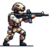
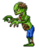
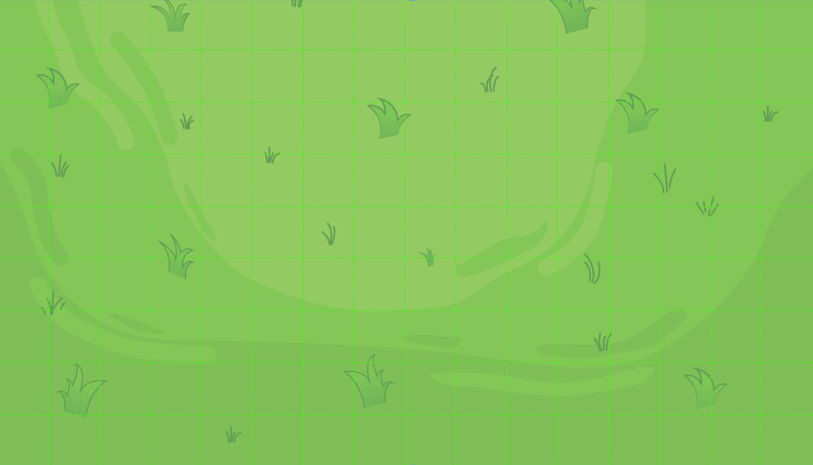
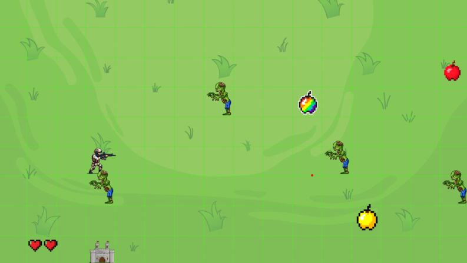

#  INVASIÓN Z

UTN - Facultad Regional Buenos Aires - Materia Paradigmas de Programación

## Equipo de desarrollo: 

- Rodrigo Juan Manuel 
- Uriel Julian Bove 
- Sebastián Santiago Ayala Osorio
- Cullen Salvador

## Explicaciones Teóricas: 
En el diseño del juego, usamos clases para definir elementos específicos como la Manzana Roja, la Manzana Dorada, la Manzana Super, el Proyectil y el Enemigo. Estas clases nos permiten crear múltiples instancias de cada uno, lo cual es útil para generar varios objetos de un mismo tipo en el juego según sea necesario. De esta forma, podemos controlar cuántas manzanas, proyectiles o enemigos aparecen, manteniendo una estructura organizada.

Aplicamos polimorfismo en las manzanas, específicamente en el método "habilidad", que permite que tanto la Manzana Roja, la Manzana Dorada y la Manzana Super respondan de forma diferente a la misma acción. Así, cuando el método "habilidad" se activa, la Manzana Roja le suma una unidad de vida al militar, mientras que la Manzana Dorada le otorga inmunidad temporal y la Manzana Super tiene la misma habilidad que la dorada ,y ademas le restablece la vida al militar. Este uso de polimorfismo nos da flexibilidad para que distintos tipos de manzanas puedan comportarse de manera única sin necesidad de crear métodos distintos para cada una.

Para distribuir las tareas y simplificar el código, delegamos ciertas responsabilidades en diferentes objetos. Por ejemplo, el método "habilidadActivada" se delega a la Manzana Dorada, y no al militar, ya que es la manzana la que tiene la capacidad de otorgarle inmunidad. También hemos delegado el método "disparar" directamente en el militar, mientras que el movimiento y la detección de colisiones del proyectil están asignados al objeto proyectil. Esto organiza mejor la estructura del código, ya que cada objeto gestiona sus propias acciones y características.

Además, empleamos herencia en las manzanas para evitar repetir código. Creamos una clase base llamada "Manzana" que sirve como plantilla para las manzanas Roja y Dorada , las cuales heredan de ella tanto comportamiento como los atributos. La Manzana Súper, por su parte, hereda de la Manzana Dorada, ya que comparte la habilidad de inmunidad pero añade la restauración completa de vida.

## Capturas 

# Reglas de Juego / Instrucciones

## Enemigos: 
-   Los enemigos aparecen en el campo y tienen dos objetivos:
    Si tocan al personaje militar, le quitan puntos de vida.
    Si llegan a la base, también le quitan puntos de vida, debilitándola progresivamente.

## Defensa de la Base: 
    La base tiene un nivel de vida que se reduce cuando los enemigos logran tocarla. 
    El jugador debe defenderla evitando que los enemigos se acerquen.
    La base se ubica a lo largo de todo el alto y bajo de la izquierda de la pantalla.
## Reparación: 
    Cuando la base está dañada, el jugador puede utilizar la tecla F para repararla,en donde el personaje
    no se podra mover ni disparar durante 4 segundos.
    El efecto de inmunidad que brindan la Manzana Dorada y Manzana Super permite que el tiempo de
    inmovilidad se reduzca a 2 segundos.
    Estas condiciones pueden hacer que el personaje se encuentre expuesto a un ataque.

## Aparición de Manzanas Especiales:
    Cada cierto tiempo, aparecerán manzanas en el campo de juego. Estas manzanas tienen diferentes
    habilidades especiales que el jugador puede recoger para obtener ventajas.

## Tipos de Manzanas:

- Manzana Roja: Suma una unidad de vida al personaje militar
- Manzana Dorada: Otorga inmunidad al personaje contra los ataques de los enemigos (zombies) durante 4 segundos,durante este tiempo los zombies no pueden quitarle vida.
- Manzana Super: Combina los efectos de la manzana dorada y un aumento completo de vida

Este es un juego donde eres un jugador que debe disparar balas con su arma para eliminar a los enemigos que aparezcan. Tu objetivo es detener a los enemigos antes de que lleguen a tu base o te eliminen a ti. Los enemigos se mueven hacia la base, y tú debes ser rápido y preciso al disparar para evitar que logren llegar. El juego termina si los enemigos llegan a la base o te derrotan.

# Controles:

## Movimientos :

- `W` para mover al militar hacia arriba.
- `A` para mover al militar hacia la izquierda.
- `S` para mover al militar hacia abajo.
- `D` para mover al militar hacia la derecha.

## Acciones Especiales :

- `F` para reparar la base.
- `P` para que el militar dispare.

# Diagrama de clases:

