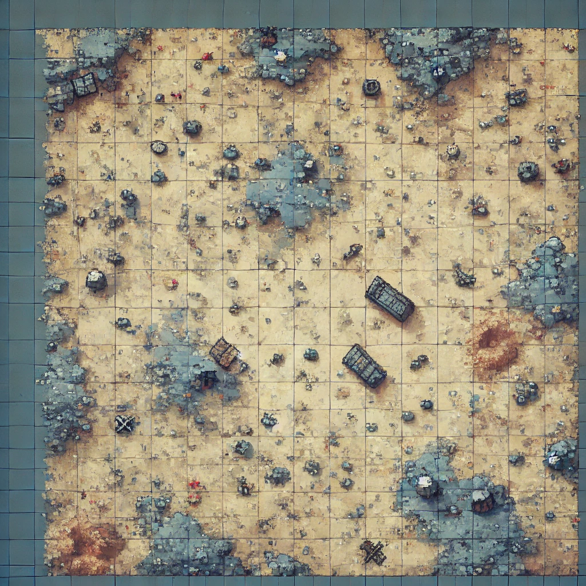

#  (reemplazar nombre de juego acá) 

UTN - Facultad Regional Buenos Aires - Materia Paradigmas de Programación

## Equipo de desarrollo: 

- Rodrigo Juan Manuel 
- Uriel Julian Bove 
- Sebastián Santiago Ayala Osorio
- Cullen Salvador

 

## Capturas 

## Reglas de Juego / Instrucciones

(completar...)

## Controles:

- `W` para...

